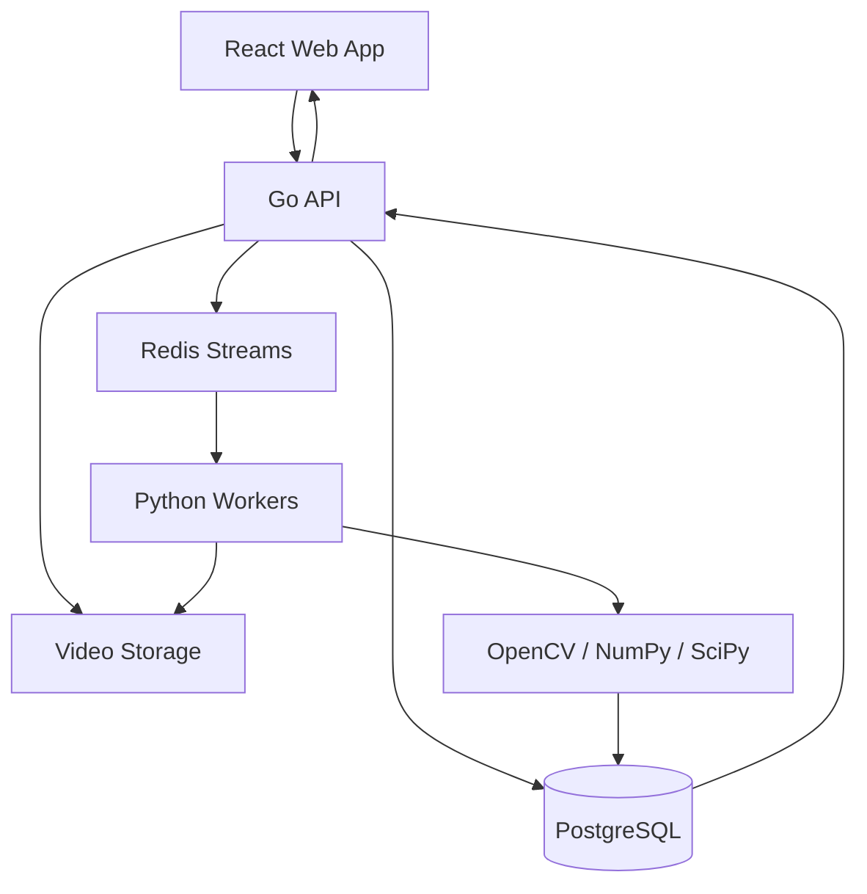

# SprinterIQ

> Web platform that derives sprint performance metrics from uploaded footage using an asynchronous computer-vision pipeline.

> **Note:** This is a personal project. Source code is proprietary and not published here.

**Stack:** Go · Python (OpenCV, NumPy, SciPy) · PostgreSQL · Redis Streams · Docker Compose · React · TypeScript

---

## Overview

Coaches and athletes can record sprint reps or races on a phone or camera. This platform ingests that footage, runs a computer-vision pipeline to track the athlete frame-by-frame, then calculates metrics that are hard to eyeball from raw video alone. This gives users data points to target drills or identify where improvement is needed.

There are two input modes: manual and video. Manual mode is independent of computer vision and processes split times entered directly by the user, simple arithmetic with no tracking involved. Video mode is the fuller pipeline, where a video is uploaded for frame by frame analysis. Both modes converge on the same asynchronous job pipeline afterwards, allowing the processing infrastructure to be validated independently of the computer-vision pipeline.

**Metrics:**
- Velocity profile
- Acceleration profile (including peak acceleration and acceleration at a specific frame, not just an aggregate)
- Time to peak velocity 
- Drive-phase metrics (future refinement)
- Split times, harder to eyeball accurately from raw video, and only available once a reference distance is provided

## Current implementation

The current version is a web application where users upload pre-recorded sprint videos or manually enter split times for asynchronous analysis.

The application runs as a multi-container Docker Compose environment:

- React + TypeScript + Tailwind CSS
- Go ingestion API
- Redis Streams queue
- PostgreSQL database
- Python analysis workers

Live capture and native mobile support are outside the current scope. The current architecture keeps services independent so the deployment model can evolve later without changing the core processing pipeline.
## Architecture



- **React + TypeScript** provides the frontend interface for uploading data and visualising analysis results.
- **Go API** handles ingestion, streaming large video uploads to disk rather than buffering them in memory, and serves job status and results.
- **Redis Streams** is a durable job queue decoupling ingestion from compute, and allowing multiple Python workers to process jobs concurrently through consumer groups.
- **Python workers** perform asynchronous computer vision and numerical analysis using OpenCV, NumPy, and SciPy.
- **Postgres** holds persistent session, job, and result state.

## Stack

| Layer | Technology | Role |
|---|---|---|
| Client | React + TypeScript | Upload UI, results dashboard (curve charts, split times) |
| Ingestion API | Go | Streams large video uploads to disk, writes metadata, enqueues jobs, serves job status/results |
| Queue | Redis Streams | Durable, at least once job dispatch to the worker pool |
| Compute | Python workers (OpenCV, NumPy, SciPy) | Frame extraction, athlete tracking, kinematic curve computation |
| Storage | PostgreSQL | Sessions, video metadata, job state, result curves |
| Orchestration | Docker Compose | Runs go-api, python-worker(s), redis, postgres, react together locally |

## Workflow

1. User uploads a video, or enters manual splits, from the React app.
2. The Go API writes metadata to Postgres and streams video files to disk.
3. A job is added to Redis Streams.
4. A Python worker in a consumer group claims the job and performs analysis (or, for manual mode, direct arithmetic on the submitted splits).
5. Results and final job state, and the worker acknowledges (XACK) the job.
6. The client polls the API and displays the results.

## Computer vision pipeline

A reference distance is required because OpenCV produces pixel coordinates, not real-world units. Without a known distance visible in the frame there is no way to convert pixel displacement per frame into an actual velocity, since that ratio changes with camera distance, angle, and zoom. Below is a simplified calibration ratio, assuming distance is measured along the same plane as movement:

```
real_velocity = pixel_velocity * (known_distance_metres / pixel_distance_between_reference_points)
```

Pipeline stages:

```
Tracking
   ↓
Calibration
   ↓
Smoothing
   ↓
Velocity
   ↓
Acceleration
   ↓
Metrics
```

Tracking extracts the athlete's pixel coordinates per frame. Calibration converts those coordinates into real-world units using the reference distance. Raw tracked position is noisy, and differentiating it directly would produce unusably jagged velocity and acceleration curves, so a Savitzky-Golay filter smooths the position signal first. Smoothed position is differentiated once for velocity and again for acceleration, allowing metrics to be derived from the kinematic curves rather than estimated from simple aggregate heuristics. This means results are physically interpretable at any single frame, as opposed to only as an aggregate statistic. Split times and the other headline metrics are then read off these curves.

## Design decisions

**Redis Streams** were chosen over Pub/Sub because jobs need durable delivery and acknowledgement. Streams allow workers to claim jobs, acknowledge completion, and recover unprocessed work after failures.
 
 
**Streamed uploads, not buffered.** The Go API writes incoming video to disk as it arrives rather than loading the full request body into memory first, keeping memory usage flat regardless of file size. This matters once slow-motion footage is involved, which can run into several hundred megabytes per file.
 
 
 
**Video storage on disk, not in Postgres.** Large binary files would bloat every backup and slow down queries on tables that should otherwise stay small and fast. Postgres stores structured metadata and a file path; the bytes live on disk.
 
 
 
**Job state kept separate from queue state.** Redis Streams tracks delivery and acknowledgement, whether a job has been picked up and acked, which is a queueing concern. Postgres tracks an explicit status column (pending, processing, completed, failed) plus the actual results, which is an outcome concern. These are related but distinct: Redis answers whether a job has been picked up, Postgres answers what happened and what the results were. There is no return path through Redis; the client polls Go, Go reads the result from Postgres, and Go returns it to the client.
 

## Roadmap

**Phase 1**
- Complete analytics pipeline (manual mode end to end, then video mode)
- Video mode: tracking and calibration
- Dashboard

**Phase 2**
- User/UX improvements
- Skeleton overlay and annotated output video, rendering tracked keypoints back onto the source footage as a second output rather than just numbers
- Server sent events (SSE), replacing polling to reduce latency once the pipeline is stable

**Phase 3**
- Native mobile client
- User authentication

**Phase 4**
- AI coaching (exploratory)
- Evaluate on-device processing feasibility

## Current limitations

- Web application only (v1)
- Video upload only, no live capture
-Automatic distance estimation is not currently planned because reliable scale estimation from arbitrary footage introduces significant additional complexity. 

- Acceleration metrics assume a typical sprint drive phase. Some sprinters do not drive the same way and run in a more upright style, which this analysis does not yet account for.

- Job recovery after API failure is not currently implemented. Production deployments would require transactional job creation or reconciliation mechanisms.
